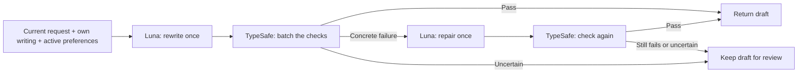

# Personal writing loop

This backend is independent of the X interface. The web application handles login,
importing, UI and posting. `mimicry.loop.LoopService` handles writing, checking and learning.

## Three modes

| Label | `writing_mode` | Writer behavior | Personal checks and learning |
| --- | --- | --- | --- |
| AI refine + Personalize | `refine_personalize` (default) | Improve clarity and apply the author's voice in one pass | Enabled |
| Personalize only | `personalize` | Minimal changes to diction, rhythm and voice; no independent polish or argument restructuring | Enabled |
| AI refine only | `refine` | Improve clarity, grammar and flow without imitating the author | Disabled |

Both personalization modes need at least 80 characters of selected writing or stored
own-text evidence. Refine-only needs no reference writing. Its provider payload excludes
references, contrasts and preferences, and it evaluates only the three fixed checks.
Edits from refine-only runs are recorded but never update personal style memory.

All three modes retain the same meaning/current-request checks and one-repair limit.
A repair keeps the selected mode. Personalize-only can change ordering when an applicable
personal preference or the current request requires it; it does not perform a separate
clarity pass. These are distinct writer instructions, not guarantees of a particular edit
size. The app can use the exact labels above for its mode selector.

## One draft, one check, at most one repair



In the default mode, Luna improves clarity and personalizes wording in one request. The loop does
not generate a candidate pool, assign a style total, fit weights, or rewrite merely
to increase a score. It retains the source separately from generated text.

Three fixed Noul questions check preserved meaning, invented facts and compliance
with the **current writing request**. The last question explicitly checks opening,
ordering, required wording, language and exclusions. Tweet length is checked in code.

Each active preference adds two Noul questions to the same request:

1. Does this historical preference apply here, without an exception or a conflict
   with the current request? This question ignores the candidate.
2. Assuming it applies, does this candidate violate the preference?

Code consumes the violation only when applicability is at least 0.8. A high style
signal cannot compensate for a failed current instruction. The actual probabilities,
questions and actions are stored with the frozen policy used by that run.

For fixed checks, `p(yes) >= 0.8` passes and `<= 0.2` fails. For an applicable
violation check, the polarity reverses. Intermediate values require review; uncertain
applicability skips that historical default. These thresholds are prototype settings,
not established calibration on a user's tweets. Noul is a probability of yes, not a
style intensity or an authorship probability.

Only a concrete failure triggers repair. The writer receives the failed condition,
relevant rule and current draft. After one repair the loop stops. A repair with a new
factual or instruction failure cannot replace a previously acceptable draft. When
nothing passes the fixed checks, `selected="original"` retains the source and
`review_required=true`; that source may contain instructions and is not a ready tweet.

The result contains `versions.original`, `versions.draft`, optional `versions.repair`,
`selected`, `selected_eligible`, `review_required`, `review_version`, `steps`, `criteria`, and raw answers.
`review_version` identifies the last draft with no definite hard failure, including
a draft with uncertain checks. Show it explicitly as a review candidate; never treat
it as accepted. There is no `score` or legacy `judgment.style_mean` in v2. UI integration must display
checks and review status instead of expecting a rating. Nothing is auto-posted.

## An edit becomes a small, scoped preference

```text
Human edit → TypeSafe attributes style vs changed intent
           → Luna proposes one preference + situation + exception
           → Replay the edit and a synthetic exception: shadow rule
           → Another distinct human edit supports it: active rule
           → Later human edit contradicts it: suspend rule
```

A proposal is plain English. Code constructs the two Noul questions, so learned
content cannot change the fixed checks or introduce competing Score rubrics.
A maximum of five active preferences keeps the writer's context short.

Example:

- Preference: lead a build update with the concrete friction, then the fix.
- Situation: the source actually contains both friction and progress.
- Exception: the current request explicitly asks for an announcement first.

The triggering edit must be judged faithful, in scope, and a clear correction of
this specific preference. Luna also proposes a conflicting writing instruction, which code appends to the
original facts, and a faithful response. The new question must recognize that its preference does not apply
there. This is a self-check, **not an independent evaluation**.

A shadow rule is excluded from writing. It becomes active only after a later,
different human edit confirms it, with no contradiction among the checked later edits.
The validation replay is bounded to ten recent distinct intent groups. No fitted
ranker, loss function or significance threshold is involved. Two edits justify a
reversible personal default; they do not prove that it generalizes.

A subsequent faithful human edit that clearly violates an active rule suspends it.
An explicit current exception merely skips it for that request. Synthetic and sealed
feedback cannot activate or suspend preferences. Changed facts or intent do not count
as style learning. All changes are owner scoped and versioned; rollback is supported.

## Integration

For Chrome, use the versioned HTTP API and browser client described in
[Chrome loop integration](chrome-loop-integration.md).

```python
from mimicry.loop import LoopService

async with LoopService() as loop:
    result = await loop.rewrite(
        authenticated_x_user_id,
        "Start with the launch: version 2 shipped. Old plugins need an update.",
        references=selected_own_tweets,
        context={"language": "en", "purpose": "build_update"},
        writing_mode="refine_personalize",
    )
    needs_review = result["review_required"]
    version = result["review_version"] if needs_review else result["selected"]
    text = result["versions"][version]["text"]

    learning = await loop.learn_from_feedback(
        authenticated_x_user_id,
        result["run_id"],
        against_version=version,
        intent_version=result["intent_version"],
        edited_text=user_edited_text,
        explanation=user_explanation,
        event_id=client_edit_id,
    )
```

Resolve the owner from the authenticated session. `event_id` is an idempotency key;
retries must reuse the same content. `intent_changed=True` records a changed request
without turning it into style evidence. The default partition is `development`;
`sealed` reserves independent evaluation examples and excludes them from learning.

Use `add_evidence(owner, text, context=..., kind="own")` to store selected examples.
`other_author` and `ai_variant` examples serve only as contrasts; they provide no
facts or user preferences. `inspect(owner)` exposes active rules, pending proposals,
validation and transitions. `rollback(owner, policy_id)` restores a previous v2 policy.

The existing `engine.rewrite(..., owner_id=...)` delegates to this backend. Calls
without an owner retain the separate app pipeline and its result shape.
The legacy engine's repair budget is capped at one when delegating to the loop.

```bash
uv run python -m mimicry.loop --owner local-profile rewrite \
  --draft-file draft.txt --reference-file my-tweets.txt --purpose build_update \
  --mode refine_personalize

uv run python -m mimicry.loop --owner local-profile feedback \
  --run RUN_ID --against draft --intent-version INTENT_VERSION \
  --edit-file edited.txt --explanation "Lead with the concrete problem." --learn

uv run python -m mimicry.loop --owner local-profile rewrite \
  --draft-file draft.txt --mode refine

uv run python -m mimicry.loop --owner local-profile inspect
```

## Persistence, observability and evaluation

Settings come from the existing server `.env`. Default local storage is the ignored
`runs/personal-loop/` directory. Each run saves the policy, raw provider responses,
versions, decisions and selected text. Model versions and full question meaning are
part of the judgment cache key. Owner IDs isolate all records and caches. An old v1
policy is retained in history but automatically replaced with an empty v2 rule set;
old learned weights are never silently interpreted as rules.

`WeaveSink` is an optional metadata-only trace export. `export_wandb` exports policy
hashes and validation outcomes, excluding tweets and question text. Both are opt-in;
local JSON/SQLite traces work without either integration.

`evaluate(owner, [policy_a, policy_b])` consumes unused sealed human pairs once,
reporting which candidates pass under each policy. It never trains or promotes.
Passing a preferred candidate while rejecting the other is useful evidence; accepting
both is not a successful discrimination, and rejecting both is not a win.

```bash
uv run --extra dev pytest -q tests/test_personal_loop.py
uv run --extra dev ruff check src/mimicry/loop tests/test_personal_loop.py
uv run python scripts/evaluate_personal_loop.py --live
uv run python scripts/smoke_writing_modes.py --live
```

The live script records a frozen fictional regression manifest, a real Luna rule
proposal, real TypeSafe probabilities and actual rewrites under `runs/loop-v2/`.
The known launch-order failure is a regression case, not fresh test evidence. This
small suite does not establish human preference improvement or superiority to GPT.
Earlier v1 results remain under `runs/loop-effectiveness/`; its replaced implementation
is archived locally under `runs/loop-v1-source-archive/`.

This follows TypeSafe's [Noul](https://docs.typesafe.ai/primitives/noul) and
[building guide](https://docs.typesafe.ai/concepts/how-to-build-with-system-one):
models supply typed judgments, while code owns the workflow and uncertainty handling.
